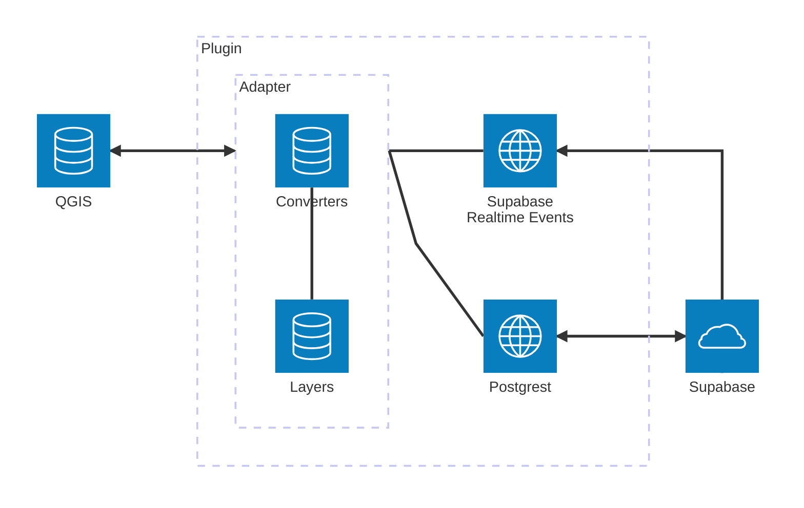

# Jakarto layers QGIS Plugin

Prototype to view and edit Jakarto layers in QGIS.

## Concept

Les "layers Jakarto" sont des couches de géométries vectorielles stockées sur le serveur de Jakarto.

Le but est de pouvoir les charger et les éditer dans QGIS, et qu'ils soient synchronisés avec les autres services de Jakarto (jakartowns, etc.). QGIS n'est pas requis, on peut s'en servir pour partager des données entre collègues sur Jakartowns seulement.

## Architecture et détails d'implémentation

`Adapter` s'occupe d'écouter les évènements, transformer les features (`Converters`) et les passer soit à QGIS, soit à Supabase. Pour se connecter à QGIS, il utilise les fonctionnalités de plugin QGIS. Pour se connecter à Supabase, il utilise les librairies `postgrest` (pour les évènements de QGIS) et `realtime` (pour les évènements externes).

La correspondance entre les ids des features QGIS et Supabase sont stockées en mémoire dans la classe `Layer`.

Il y a 6 types d'évènements:

- `qgis_insert`: une feature est créée dans QGIS
- `qgis_update`: une feature est mise à jour dans QGIS
- `qgis_delete`: une feature est supprimée dans QGIS
- `supabase_insert`: une feature est créée dans Supabase
- `supabase_update`: une feature est mise à jour dans Supabase
- `supabase_delete`: une feature est supprimée dans Supabase

Pour chaque évènement, l'adapter va transformer les features et les passer à l'autre service (soit QGIS, soit Supabase). Il doit aussi ignorer le prochain message, par exemple:

- `QGISInsertEvent` -> La feature est envoyée à Supabase
- `SupabaseInsertMessage` -> On reçoit un message, mais pour la même feature qui vient d'être créée, on ignore le message

## Roadmap

- [x] Afficher les layers dans QGIS
- [x] Créer et modifier des points sur les layers, et que ce soit synchronisé avec la base de données supabase
- [x] Écouter les modifications sur les layers dans supabase et les appliquer aux layers dans QGIS.
- [x] Afficher les layers dans Jakartowns
- [x] Créer et modifier des points sur les layers dans Jakartowns et que ce soit synchronisé avec la base de données supabase
- [x] Implémenter la protection et les droits d'accès des couches
- [x] Pour aider à la localisation, afficher un point à l'endroit où l'utilisateur se trouve dans le navigateur Jakartowns (comme le curseur jaune sur la minimap de Jakartowns)
- [ ] Implémenter pour les autres types de géométries

## Installation

Le projet est encore très prototype, il se peut qu'il manque des étapes dans cette liste (notamment, le développement sous Windows n'est pas encore supporté):

- (Optionel) Suivre les instructions pour [installer supabase en self host](https://supabase.com/docs/guides/self-hosting/docker)
- Exécuter `just venv` pour créer l'environnement virtuel et installer les dépendances.
- Ouvrir QGIS avec le repo comme dossier de plugin: `just run-qgis`
- Installer "Jakarto layers qgis plugin" dans le menu des plugins QGIS.
- Le plugin "Plugin Reloader" est recommandé pour le développement, il fonctionne bien avec ce projet.

Voir `just` pour d'autres commandes de développement.

## Notes

Dans QGIS, QtWebKit n'est pas utilisable, et l'installation de QtWebEngine n'est pas assez fluide pour le recommander aux utilisateurs.

Toutefois, avec QGIS 4 et Qt6, il serait peut-être possible d'afficher un navigateur web directement dans l'interface de QGIS.
