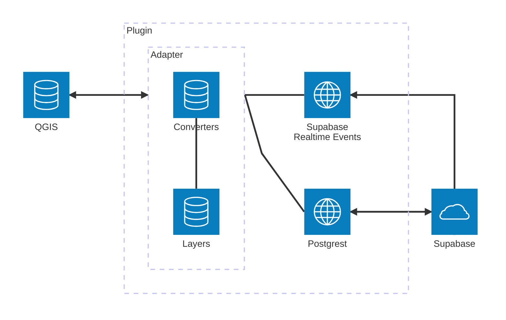

# Jakarto Real-Time Layers QGIS Plugin

Prototype to view and edit Jakarto Real-Time Layers in QGIS.

## Concept

"Jakarto Real-Time Layers" are vector geometry layers stored on the Jakarto server.

With this plugin, you can load and edit them in QGIS, and have them synchronized with other Jakarto services (jakartowns, etc.). QGIS is not required to use Real-Time Layers, it can be used to share data between users on Jakartowns only.

## Architecture and Implementation Details

`Adapter` handles listening to events, transforming features (`Converters`) and passing them either to QGIS or Supabase. To connect to QGIS, it uses QGIS plugin functionality. To connect to Supabase, it uses the `postgrest` (for QGIS events) and `realtime` (for external events) libraries.

The correspondence between QGIS and Supabase feature IDs is stored in memory in the `Layer` class.

There are 6 types of events:

- `QGISInsertEvent`: a feature is created in QGIS
- `QGISUpdateEvent`: a feature is updated in QGIS
- `QGISDeleteEvent`: a feature is deleted in QGIS
- `SupabaseInsertMessage`: a feature is created in Supabase
- `SupabaseUpdateMessage`: a feature is updated in Supabase
- `SupabaseDeleteMessage`: a feature is deleted in Supabase

For each event, the adapter will transform the features and pass them to the other service (either QGIS or Supabase). It must also ignore the next message, for example:

- `QGISInsertEvent` -> The feature is sent to Supabase
- `SupabaseInsertMessage` -> We receive a message, but for the same feature that was just created, we ignore the message

## Roadmap

- [x] Display layers in QGIS
- [x] Create and modify points on layers, and have it synchronized with the Supabase database
- [x] Listen to modifications on layers in Supabase and apply them to layers in QGIS
- [x] Display layers in Jakartowns
- [x] Create and modify points on layers in Jakartowns and have it synchronized with the Supabase database
- [x] Implement layer protection and access rights
- [x] To help with localization, display a point at the user's location in the Jakartowns browser (like the yellow cursor on the Jakartowns minimap)
- [ ] Implement for other geometry types

## Installation

The project is still very much a prototype, some steps might be missing from this list (notably, development under Windows is not yet supported):

- (Optional) Follow the instructions to [install Supabase self-hosted](https://supabase.com/docs/guides/self-hosting/docker)
- Run `just venv` to create the virtual environment and install dependencies
- Open QGIS with the repo as plugin folder: `just run-qgis`
- Install "Jakarto layers qgis plugin" in the QGIS plugins menu
- The "Plugin Reloader" plugin is recommended for development, it works well with this project

See `just` for other development commands.

## Notes

In QGIS, QtWebKit is not usable, and the installation of QtWebEngine is not smooth enough to recommend to users.

However, with QGIS 4 and Qt6, it might be possible to display a web browser directly in the QGIS interface.
